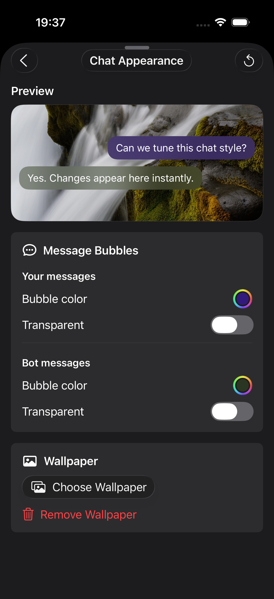
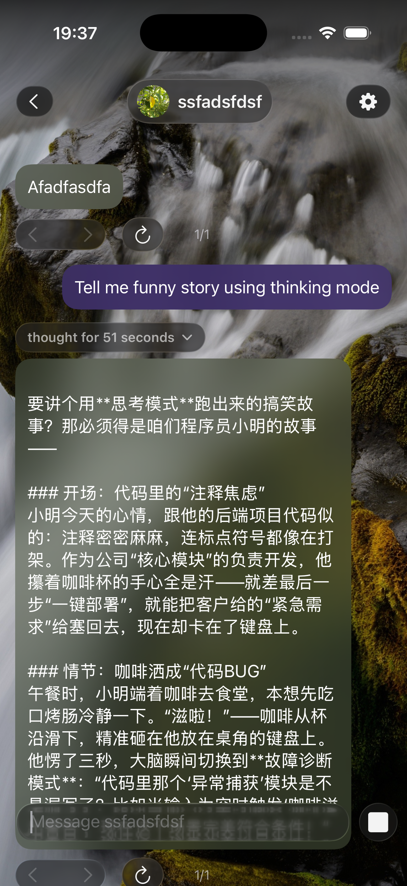
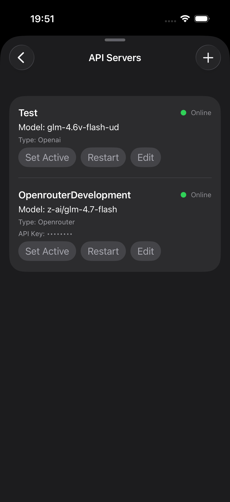

# EchoUI ios — simple frotend LLM app for iOS

This application was written in order to transfer the character of AI and so on experience to open source. The entire app is built on swift, swift, and swift data. The project was mostly built with the help of ChatGPT. Initially, I created it for personal use, but decided to open source it since there aren’t many solid alternatives to ChatterUI available at the moment.

## API support:
- OpenAI compatitive APIs
- OpenRouter compatitive APIs

## Features:

- Character and Persona Creation
- Viewing older chats
- Connecting to OpenRouter API and OpenAI compatitive APIs
- Markdown markup in messages
- Almost everything that Character AI/Janitor AI have

  
  
  
  

## Usage:

To get started, build (or download .ipa file if I haven't forgot to upload it) the .ipa file.

Currently, the application is not available on the App Store, so you can install it using AltStore (or whatever you using).

Steps for Installation:

+ Download and install AltStore (or whatever you using).
+ Open AltStore (or other sideloading program) and add the downloaded .ipa file.
+ Follow the on-screen instructions to complete the installation.

