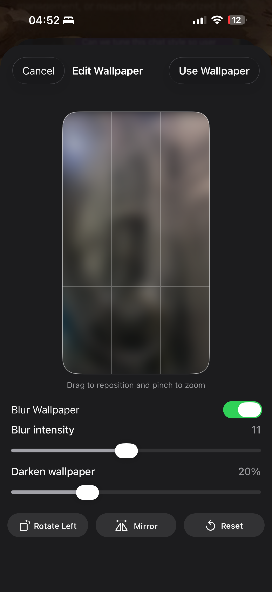
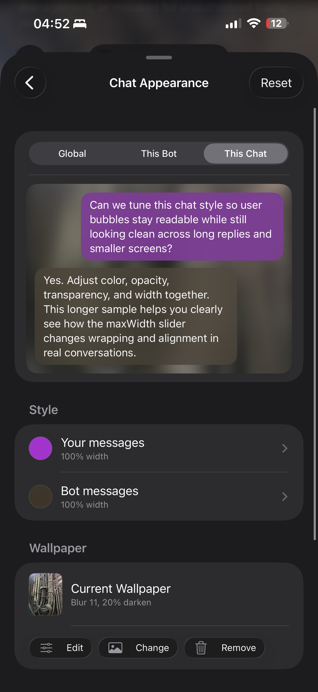
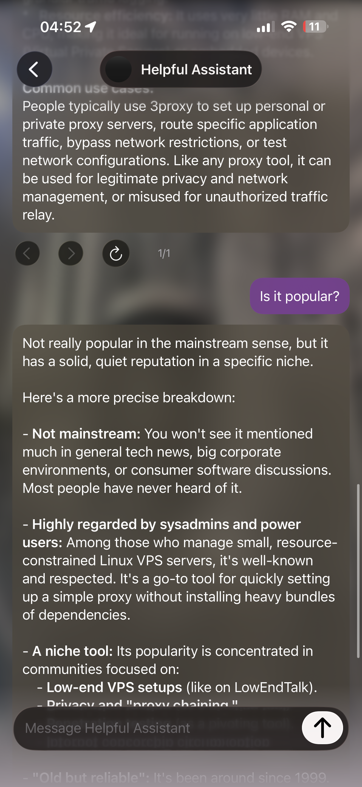
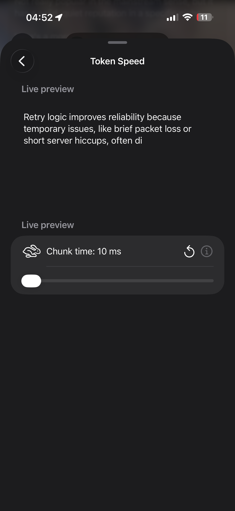
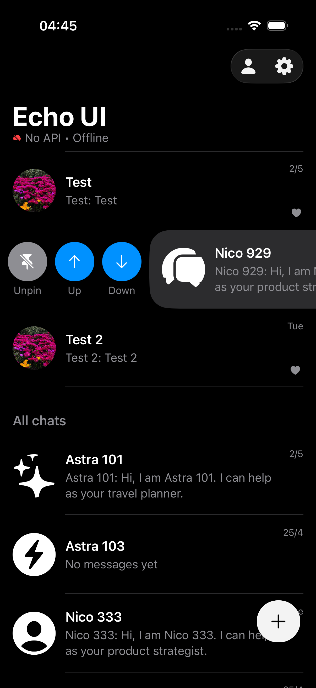
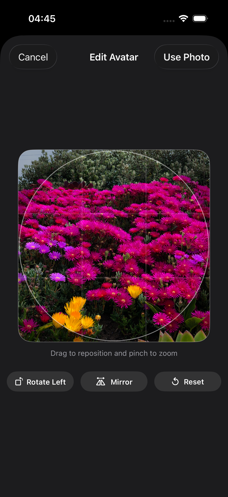
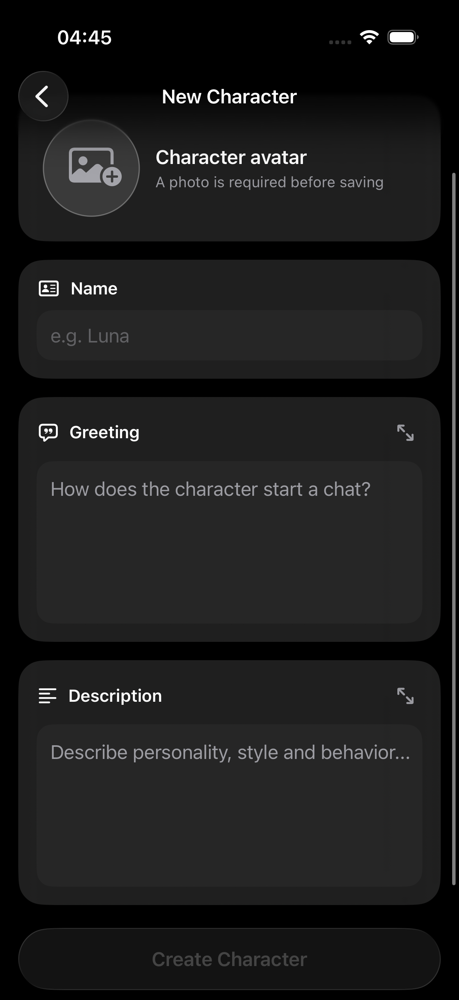
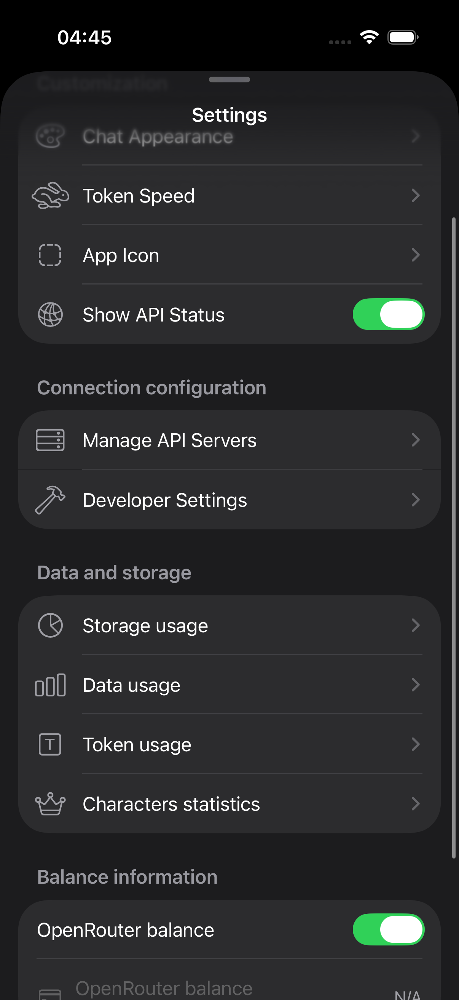
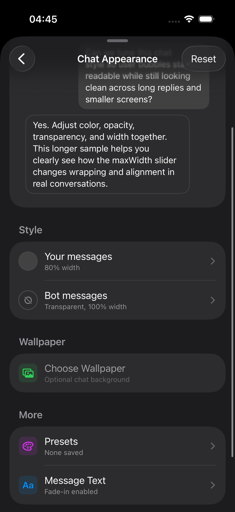
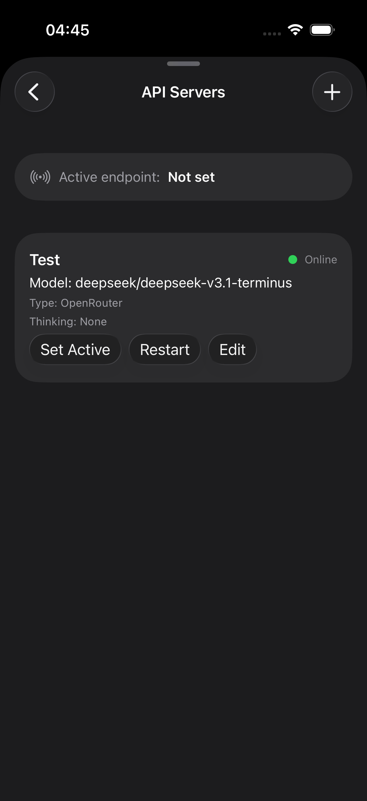

<p align="center">
  
</p>

<h1 align="center">EchoUI for iOS</h1>

<p align="center">
  A native SwiftUI chat app for character-driven AI conversations, personas, OpenAI-compatible APIs, and OpenRouter.
</p>

## Overview

EchoUI is an open-source iOS app for chatting with custom AI characters. It is built with SwiftUI and SwiftData, stores chats locally, and connects to OpenAI-compatible chat APIs or OpenRouter.

The app supports character and persona workflows, streaming chat responses, local chat history, appearance customization, and API server management in a native iOS interface.

## Screenshots

<p align="center">
  
  
  
  
  
  
  
  
  
  
</p>

## Requirements

- macOS with a recent Xcode version that includes the iOS 26 SDK.
- iOS 26.0 or later. The project deployment target is currently `IPHONEOS_DEPLOYMENT_TARGET = 26.0`.
- An Apple Developer account or free Apple ID for signing if you want to run the app on a physical device.
- An API key for the provider you want to use, unless your endpoint does not require one.

## Build From Source

1. Clone or download this repository.
2. Open `FrontendAI.xcodeproj` in Xcode.
3. Select the `FrontendAI` scheme.
4. Select an iPhone simulator or a connected iPhone as the run destination.
5. Open the target signing settings and choose your Apple development team.
6. Press `Cmd + R` to build and run the app.

You can also build from Terminal:

```sh
xcodebuild -project FrontendAI.xcodeproj -scheme FrontendAI -destination 'generic/platform=iOS Simulator' build
```

## Build an IPA

Use this when you want to install the app with AltStore, SideStore, Sideloadly, Apple Configurator, or another sideloading tool.

1. Open `FrontendAI.xcodeproj` in Xcode.
2. Select `FrontendAI` as the scheme.
3. Select `Any iOS Device` or connect your iPhone.
4. Go to `Product > Archive`.
5. When the archive finishes, open the Organizer window.
6. Choose `Distribute App`.
7. Select the distribution method that matches your signing setup.
8. Export the `.ipa`.
9. Add the `.ipa` to your sideloading tool and follow that tool's installation flow.

If signing fails, check these first:

- A development team is selected for the app target.
- The bundle identifier is unique to your Apple account.
- Your device is trusted and available in Xcode.
- Your Apple account has a valid provisioning profile for this app.

## First Run Setup

1. Open EchoUI.
2. Open Settings with the gear button.
3. Go to `Manage API Servers`.
4. Add an API server.
5. Choose `OpenAI` for OpenAI-compatible endpoints or `OpenRouter` for OpenRouter.
6. Enter the base URL, API key, and model.
7. Save the server and set it as active.
8. Create a character from the main screen.
9. Optional: create a persona and select it before starting a chat.

Official endpoint examples:

```text
https://openrouter.ai
https://api.openai.com
```

## Supported APIs

- `OpenAI`: APIs that follow the OpenAI chat-completions format, including reasoning-effort and toggle-only thinking controls.
- `OpenRouter`: OpenRouter-compatible endpoints with model catalog, reasoning, and balance support.

EchoUI can stream chat responses, load model lists, use optional Bearer token authentication, and normalize base URLs such as `https://api.example.com` and `https://api.example.com/v1`.

## Security Notes

- API keys are stored in the iOS Keychain.
- Official OpenAI and OpenRouter endpoints are expected to use HTTPS.
- Bearer tokens should only be sent over HTTPS.
- Plain HTTP endpoints show a warning and should not receive API keys.
- Custom CA certificates can be imported for trusted self-signed TLS endpoints.

## Features

- Character creation, editing, avatars, pinning, reordering, and deletion.
- Persona creation, editing, avatar support, prompt configuration, and per-chat selection.
- Streaming chat with stop, regenerate, edit, copy, delete, and local history.
- Live Markdown with headings, nested lists, task lists, quotes, tables, code blocks, links, and images; cached incremental rendering keeps streaming efficient. See [Markdown support and performance](Documentation/Markdown.md).
- Appearance customization for message bubbles, wallpapers, app icons, animation, and chat presets.
- API server management with model loading, status checks, OpenRouter search, balance display, and custom TLS support.
- Local data storage with cache controls, recovery handling, usage charts, token estimates, and character statistics.

## Project Layout

- `FrontendAI/App`: SwiftUI app entry point and app configuration.
- `FrontendAI/Core`: shared models, managers, and environment keys.
- `FrontendAI/Features`: feature modules for API, bots, chat, personas, settings, and usage.
- `FrontendAI/SharedUI`: reusable views, sheets, and UI components.
- `FrontendAI/Resources`: asset catalog, app icons, and provider icons.
- `Documentation/Screenshots`: README screenshots.

## Notes

- EchoUI is not currently available on the App Store.
- The current Xcode target is configured for iPhone.
- Some API providers may require exact model IDs, paid credits, or provider-specific permissions.
- Reasoning display depends on whether the selected model or provider returns reasoning data.
